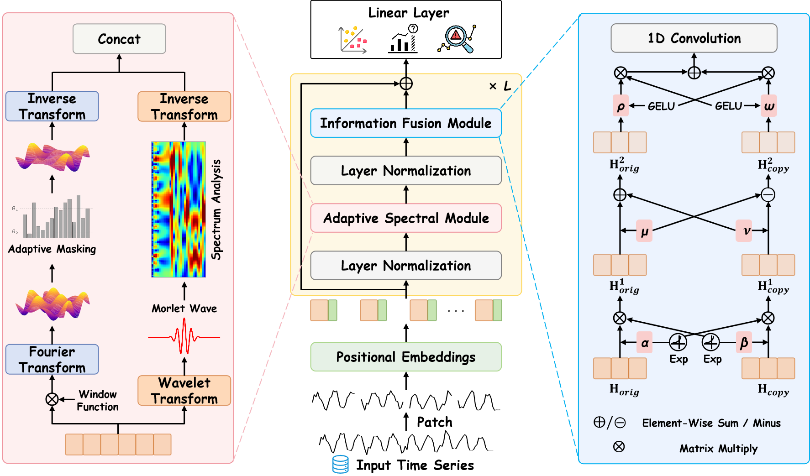

# FusAD - Time-Frequency Fusion with Adaptive Denoising for General Time Series Analysis

FusAD is a **modular, unified framework** for time series analysis that supports **classification**, **forecasting**, and **anomaly detection** tasks in a single, well-structured codebase.




## 🚀 Quick Start

### Installation

```bash
# Clone the repository
git clone
cd FusAD

# Install dependencies
pip install torch torchvision pytorch-lightning
pip install torchmetrics timm einops scikit-learn pandas numpy
```

### Basic Usage

#### 1. Classification Task

```bash
python FusAD.py --task classification \
  --data_path data/hhar \
  --emb_dim 128 \
  --depth 2 \
  --batch_size 16 \
  --num_epochs 100 \
  --pretrain_epochs 50 \
  --ASM True \
  --IFM True \
  --adaptive_filter True
```

#### 2. Forecasting Task

```bash
python FusAD.py --task forecasting \
  --data ETTh1 \
  --root_path data/ETT-small \
  --data_file ETTh1.csv \
  --seq_len 96 \
  --pred_len 96 \
  --emb_dim 64 \
  --depth 3 \
  --batch_size 64 \
  --train_epochs 20
```

#### 3. Anomaly Detection Task

```bash
python FusAD.py --task anomaly_detection \
  --data_path MSL \
  --seq_len 100 \
  --emb_dim 128 \
  --depth 3 \
  --batch_size 32 \
  --train_epochs 10 \
  --learning_rate 0.0001 \
  --anomaly_ratio 1.0 \
  --enc_in 55
```

### Using Shell Scripts

For convenience, use the provided shell scripts:

```bash
# Classification
bash scripts/run_classification.sh

# Forecasting 
bash scripts/ETTh1.sh

# Anomaly Detection
bash scripts/anomaly_MSL.sh
```


## 📜 Shell Scripts

The `scripts/` directory contains ready-to-use shell scripts for different tasks:

### Forecasting Scripts
```bash
bash scripts/ETTh1.sh      # ETTh1 dataset
bash scripts/ETTh2.sh      # ETTh2 dataset  
bash scripts/ETTm1.sh      # ETTm1 dataset
bash scripts/ETTm2.sh      # ETTm2 dataset
bash scripts/electricity.sh # Electricity dataset
bash scripts/exchange.sh   # Exchange dataset
bash scripts/traffic.sh    # Traffic dataset
bash scripts/weather.sh    # Weather dataset
```

### Anomaly Detection Scripts
```bash
bash scripts/anomaly_MSL.sh # MSL dataset
bash scripts/anomaly_PSM.sh # PSM dataset
```


## 🛠️ Dependencies

```bash
# Core ML frameworks
torch>=1.12.0
pytorch-lightning>=1.8.0
torchmetrics>=0.10.0

# Additional utilities
timm>=0.6.0                # Transformer utilities
einops>=0.6.0              # Tensor operations
scikit-learn>=1.1.0        # Evaluation metrics
pandas>=1.4.0              # Data processing
numpy>=1.21.0              # Numerical computing
```

## 📄 Citation

If you use FusAD in your research, please cite:

```bibtex
@article{zhang2025fusad,
  title={FusAD: Time-Frequency Fusion with Adaptive Denoising for General Time Series Analysis},
  author={Da Zhang, Bingyu Li, Zhiyuan Zhao, Feiping Nie, Junyu Gao, and Xuelong Li},
  booktitle={2026 IEEE 42nd International Conference on Data Engineering (ICDE)},
  year={2025},
  organization={IEEE}
}
```


